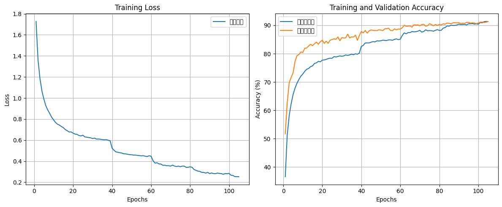

# CIFAR-10 CNN 分类模型优化

在 CIFAR-10 上实现高性能图像分类，通过多种正则化手段有效控制过拟合。

## 方法亮点
- 深度 CNN 架构（3 个卷积块 + BatchNorm + Dropout）
- 5 种防过拟合策略：数据增强、Dropout、L2 正则、早停、学习率自适应衰减
- 完整训练-验证-保存-评估流程

## 结果
- **验证准确率：91.35%**
- **训练 vs 验证准确率差距：-0.02%**（几乎无过拟合）

